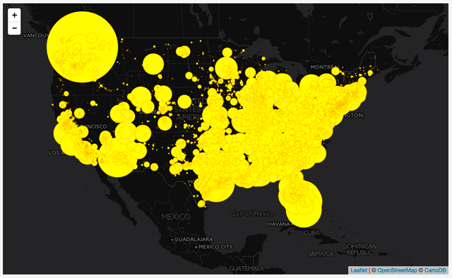
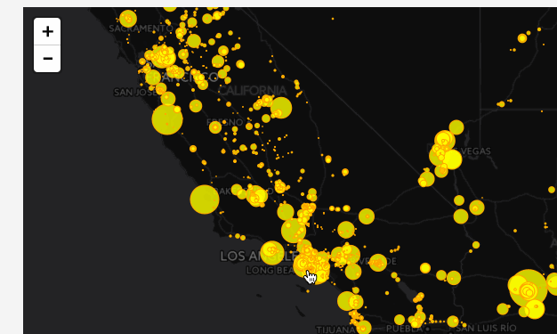
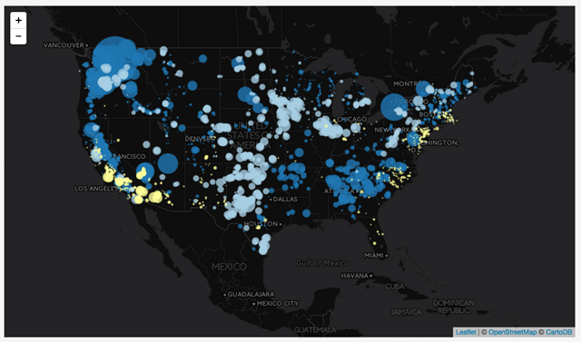

# Lab 07: Making a Proportional Symbol Map in Leaflet

## Table of Contents

<!-- TOC -->

- [Lab 07: Making a Proportional Symbol Map in Leaflet](#lab-07-making-a-proportional-symbol-map-in-leaflet)
    - [Table of Contents](#table-of-contents)
    - [Overview](#overview)
    - [Part I. Understanding the lesson (**1 pt**)](#part-i-understanding-the-lesson-1-pt)
    - [Part II. Storing and loading GeoJSON data as an external file (**2 pt**)](#part-ii-storing-and-loading-geojson-data-as-an-external-file-2-pt)
    - [Part III: Proportional symbol maps (**7 pts**)](#part-iii-proportional-symbol-maps-7-pts)
        - [Dealing with overlap in proportional symbols](#dealing-with-overlap-in-proportional-symbols)
        - [Radius versus area in proportional symbols](#radius-versus-area-in-proportional-symbols)
        - [Adding user interaction to each feature](#adding-user-interaction-to-each-feature)
            - [Adding a mouse over or mouse out affordance](#adding-a-mouse-over-or-mouse-out-affordance)
            - [Binding the Leaflet tooltips/popups to each feature.](#binding-the-leaflet-tooltipspopups-to-each-feature)
        - [Creating a Bi-variate Map With Multiple GeoJson Layers](#creating-a-bi-variate-map-with-multiple-geojson-layers)
            - [Creating separate layers in Leaflet](#creating-separate-layers-in-leaflet)
    - [Lab Assignment](#lab-assignment)

<!-- /TOC -->

## Overview

With our solid foundation in JavaScript, will now focus on making thematic maps using GeoJSON data. To begin this lab, open the *index.html* the *lab-07/* directory and follow the tutorial and instructions below, saving your work and committing changes to Git as you go.

## Part I. Understanding the lesson (**1 pt**)

As the lesson instructions indicate, run through **Part I** in the lesson _README.md_ and use the _lesson-07/index.html_ file to write/execute the statements presented in the lesson. Save a copy of your current *index.html* file as *part-1.html* and commit changes to Git. You can of course comment out statements that you're already completed. Commit changes as you go and finally push the *part-1.html* to your GitHub repo.

## Part II. Storing and loading GeoJSON data as an external file (**2 pt**)

As the lesson instructions indicate, run through **Part II** in the lesson _README.md_ and add the code to the _lesson-07/index.html_ file to write/execute the statements presented in the lesson. You'll need to write 100% of the statements. Save a copy of your current *index.html* file and commit changes to Git.

## Part III: Proportional symbol maps (**7 pts**)

Proportional symbol maps are a useful alternative to choropleth maps used to map total or ratio data and have some significant advantages over them (i.e., they don't need to be standardized like choropleth maps). We can use precise point data to make a proportional symbol map (such as the location of a coal plant), or conceptual point data (i.e., a wind farm covers a large area, but we can still represent it as a point). 

Proportional symbol maps are also good at showing relative magnitudes (i.e., "I can tell that this one is larger than that one"). We can make proportional symbol maps with any shape, though circles are the most common, and we'll go with this in this lab.

To achieve proportional symbols within our Leaflet map, we'll scale the symbols using a known quantity: specifically the amount electric capacity of the plants already encoded within our GeoJSON data. We'll use this data attribute to set the radius of our Leaflet *CircleMarkers*. We can implement this directly within our *pointToLayer*'s function, as it is passed in as the `feature` parameter of this function.

As we saw in the lesson's filtering examples, within the `pointToLayer()` function, we can access the value of the power capacity (in megawatt hours) with the reference `feature.properties.capacity_mw`.

```javascript
L.geoJson(plants, {
  pointToLayer: function(feature,latlng) {
    return L.circleMarker(latlng, {
      color: 'orange',
      weight: 1,
      fillColor: 'yellow',
      fillOpacity: 1,
      radius: feature.properties.capacity_mw
    });
  }
}).addTo(map);
```

Save this change and refresh the browser. What happens? Remember that some of these numeric values in the 1000s, so we're drawing circles with pixel radii in the 1000s!

While it makes sense to apply this value to radius (i.e., ` radius: feature.properties.capacity_mw`, we don't want to do that. There are two problems with this. First, the values of some of these numbers are quite huge (at least for specifying pixels) and as a result, the circles end up filling up the entire world map.

One simple solution to this: just reduce the value of each by an equal amount (i.e., `radius: feature.properties.capacity_mw * .01`). By the way, there is nothing magical about the number`.01`. This number works well given the magnitudes of these particular data. We'll adjust this "scale factor" differently depending on the data.

This appears to work although it still faces the second problem of overlap.

  
**Figure 01**. Problematic proportional symbols

Before we deal with the second problem of applying the numeric value as the radius of each circle, we'll deal with another design problem emerging from our coded solution.

### Dealing with overlap in proportional symbols

As we increase the size of the circles, we encounter a classic problem in proportional symbol mapping: ***symbol overlap***. Not only do the overlapping symbols make it difficult to determine their relative sizes, but in some cases, large symbols are completely covering the smaller ones.

There are three solutions to the problem of symbol overlap, and we can achieve two of them through our custom JavaScript coding.

The first is to stack the symbols so that large ones rest visually underneath the smaller ones. We can do this with a fancier version of a [JavaScript `.sort()`](http://www.w3schools.com/jsref/jsref_sort.asp) method which will filter our GeoJSON data before we use Leaflet to draw the SVG circles. By sorting the data values high to low, Leaflet draws the larger ones first and the smaller ones on top of them.

To do this, place this code in your script before you call the `L.geoJson()` method.

```javascript
plants.features.sort(function(a, b) {
  return b.properties.capacity_mw - a.properties.capacity_mw;
});
```
We can't simply apply the regular JavaScript sort method to the `plants.features` because this method attempts to sort these numbers as strings, and the method would sort the value of 34 higher than 245.

Now, when the symbols are drawn, the biggest ones are drawn first and are at the bottom. The visual result is somewhat of an improvement.

  
**Figure 02.** Stacked proportional symbols with the larger ones at the bottom

A second solution, which we can couple with stacking them with larger ones on the bottom, is to reduce the opacity of the circles' fill while retaining a high opacity of the stroke. We achieve this easily using [Leaflet's Path options](http://leafletjs.com/reference.html#path):

```javascript
return L.circleMarker(latlng, {
  color: 'orange',
  weight: 1,
  fillColor: 'yellow',
  fillOpacity: .8,
  radius: feature.properties.capacity_mw *.01
});
```

By reducing the opacity of the `fillOpacity` option, we're able to achieve a more legible proportional symbol map:

  
**Figure 03.** Stacked proportional symbols with reduced opacity

The third solution, available to us in an interactive web mapping environment is not to worry about the overlap and count on the user's ability to zoom into the map to resolve the issue (especially considering these circleMarkers resize themselves on the zoom to keep the same pixel size). Fortunately, the heavy coding required for the pan/zoom functionality is already being handled by Leaflet.

### Radius versus area in proportional symbols

There's a larger problem with the map as it is currently coded. We've used the data values to directly scale the symbol's radii. However, when making visual comparisons as it is currently coded, our eye-brain systems don't actually compare the radii, rather we compare the areas of these circles. Thus, a plant producing 20 times more power than another doesn't appear to have 20 times the area here, but an area much higher than that (20 squared times pi).

To make the map work with human brains and eyes, we calculate radii to create these areas and use these to draw the circles.

To implement this in our code, instead of directly assigning a value to the radius of each *CircleMarker*, let's assign the return value of a function, which will scale and calculate the radius for us. This is as simple as calling a function and passing our data value to it:

```javascript
radius: getRadius(feature.properties.capacity_mw)`.
```

And again if we call a function named `getRadius`, we also need to write the function named `getRadius`.

We'll do this outside of the *L.geoJson()* method call (i.e., at the bottom of our script within the global namespace). Remember the function we write needs to accept the argument we're passing, it but of course we can give it a new name in the function.  Within the function, we can inverse our old formula for determining the area of a circle (remember π\*r<sup>2</sup> from Geometry class?) to get the right radius for our circles.  

Note we're using a native JavaScript class `Math` and its property `PI` (which stores a value of, you guessed it, 3.141592653589793). After the calculation, we can multiply the result by an arbitrary scale factor (`.6` works well for these data values and again would need to be adjusted depending on the data), and then return that value to our caller.

```javascript
function getRadius(area) {
  var radius = Math.sqrt(area/Math.PI);
  return radius * .6;
}
```
  
**Figure 04.** Stacked proportional symbols with reduced opacity, scaled by area

Alright. Now we have a proportional symbol map!

### Adding user interaction to each feature

Now that we've explored some ways to filter our data, let's consider some basic interaction techniques, which will include providing information when a user clicks on or hovers over a symbol (i.e., "retrieving" information).

#### Adding a mouse over or mouse out affordance

We provide the user with a basic "affordance" or some user interaction (UI) indication that they have manipulated the interface in some way to invoke functionality. Let's now work on a simple example of an affordance by changing each feature when the user mouses over it.

To do this, we're going to make use of another one of the `L.geoJson`'s options, the `onEachFeature` option.  Like the `pointToLayer` and the `filter` options, the `onEachFeature` iterates through the GeoJSON data's features when we first create our Leaflet *GeoJson* layer. Its value is a function which passes the feature data for a particular feature, as well as the Leaflet layer we create. We're going to be employing both with the function's body. To start, we'll place a `console.log()` statement to inspect the output as the `onEachFeature` option loops through the GeoJSON data.

Let's start by adding the following to our code:

```javascript
L.geoJson(plants, {
  pointToLayer: function(feature,latlng) {
    return L.circleMarker(latlng, {
      color: 'orange',
      weight: 1,
      fillColor: 'yellow',
      fillOpacity: .8,
      radius: getRadius(feature.properties.capacity_mw)
    });   
  },
  onEachFeature : function(feature,layer) {
    // code here
  }
}).addTo(map);
```

The [Leaflet API Reference](http://leafletjs.com/reference.html#geojson-oneachfeature) informs us that this option's value is a "function that will be called once for each created Feature, after it has been created and styled. Useful for attaching events and popups to features." So like the `pointToLayer` and `filter` options we've already explored, this one too allows us to access the feature data.

But what about this `layer` property we've written? Rather than accessing the feature data of the original GeoJSON data, the `layer` gives us access to the Leaflet SVG layer that's been drawn to the DOM. If we `console.log(layer)` within this function, we'll see the output is a much more complicated Leaflet object structure (and one we don't  want to worry about if we don't have to ... this is what the API is for!).

), which are triggered by using Leaflet's `.on()` method:


```javascript
onEachFeature : function(feature,layer) {
  layer.on('mouseover', function() {
    // code goes in here
  });
  layer.on('mouseout', function() {
    // code goes in here
  });
}
```

Within those `mouseover` and `mouseout` events, we can use a `.setStyle()` method on each layer, passing a JS object with path methods of our choosing.

```javascript
layer.on('mouseover', function() {
  layer.setStyle({
    fillColor: 'red'
  });
});
layer.on('mouseout', function() {
  layer.setStyle({
      fillColor: 'yellow'
  });
});
```

Mousing over the symbols provides immediate feedback that the user is interacting with the symbols and the map. This invites further interaction (such as clicking on the symbol), to let the user know they have some control over what the map is saying.

  
**Figure 07.** Adding an interactive mouseover affordance with the onEachFeature method.

This minor gesture is but a small example of how web maps have come to differ quite drastically from a static map.

#### Binding the Leaflet tooltips/popups to each feature.

We can also use the `onEachFeature` option to bind a Leaflet Tooltip or Popup to each feature. To do so, within the option's function, use either the [`bindToolip()` method](http://leafletjs.com/reference.html#marker-bindtooltip) or the the [`bindPopup()` method](http://leafletjs.com/reference.html#marker-bindpopup), a method the `circleMarker` inherits from the Leaflet Marker class. Within the popup's parentheses, as we've seen throughout previous labs, we can insert various string (HTML) content.

```javascript
 layer.bindTooltip('hi, I am a circle');
```

This code merely inserts the string 'hi, I am a circle' within each popup. If you wanted to add feature attribute information here you would need to access it via `layer.feature.properties`:

```javascript
// name of power plant in toolip
layer.bindTooltip(layer.feature.properties.plant_name);
```

  
**Figure 08.** Accessing feature property information and adding it to a UI element (tooltip).

We just learned that filtering the map to show a single fuel source is very useful. When we do, we can see the spatial distribution of that particular energy source, as well as the relative magnitudes of those plants. However, showing two fuel sources at once allows the map to convey even more information while enabling us to make comparisons between various fuel sources. Let's now modify our code to achieve this.

### Creating a Bi-variate Map With Multiple GeoJson Layers

To create a bi-variate map we can use conditional statements within the *filter* and *onEachFeature*  options when we first create our GeoJSON `plants` data with the `L.geoJson()` method (example here is hydro and coal).

We filter the plants data for these two sources:

```javascript
filter: function(feature) {
  if (feature.properties.fuel_source.Hydro ||
    feature.properties.fuel_source.Coal) {
    return feature;
  }
}
```

The conditional `if(feature.properties.fuel_source.Hydro) {}` is testing whether there is a value for a property named `Hydro` within the `fuel_source` object. If there is a value it returns the feature. If there is no `Hydro` property (i.e., it is a coal plant), the value is undefined and the expression evaluates to false. The feature is not returned and included within the L.geoJson layers.

Then we use a conditional statement to set the style options for `Hydro` and `Coal`. We can also modify the size of the radius within these statements:

 ```javascript
 onEachFeature: function(feature, layer) {

  if (feature.properties.fuel_source.Coal) {
    layer.setStyle({
      fillColor: 'red',
      radius: getRadius(feature.properties.fuel_source.Coal)
    });
  } else if (feature.properties.fuel_source.Hydro) {
    layer.setStyle({
      fillColor: 'blue',
      radius: getRadius(feature.properties.fuel_source.Hydro)
    });
  }
 }
 ```

   
 **Figure 09:** bi-variate map showing hydro and coal power.

This is an adequate solution, though keep in mind that there may still be a design/development challenge on this particular dataset in that some plants use two or more fuel sources.

#### Creating separate layers in Leaflet

One way to deal with multiple fuel sources is to create separate Leaflet GeoJson Layers. While this may appear redundant, it is effective. We'll address the redundancy of the written code later in the module. For now though, consider the following code, which creates two separate L.geoJson layers.

This example demonstrates creating two GeoJson layers, assigning them to separate variables (`hydroLayer` and `windLayer`), and adding them to the map (note carefully that plants with both Hydro and Wind sources get added to both layers).

 ```javascript
var commonStyles = {
  weight: 1,
  stroke: 1,
  fillOpacity: .8
}

var hydroLayer = L.geoJson(plants, {
  pointToLayer: function(feature,latlng) {
    return L.circleMarker(latlng, commonStyles);
  },
  filter: function(feature) {
    if(feature.properties.fuel_source.Hydro) {
        return feature;
    }
  },
  style: function(feature) {
    return {
      color: '#1f78b4',
      fillColor: '#1f78b4',
      radius: getRadius(feature.properties.fuel_source.Hydro)
    }
  }
}).addTo(map);

var windLayer = L.geoJson(plants, {
  pointToLayer: function(feature,latlng) {
    return L.circleMarker(latlng, commonStyles);
  },
  filter: function(feature) {
    if(feature.properties.fuel_source.Wind) {
      return feature;
    }
  },
  style: function(feature) {
    return {
      color: '#a6cee3',
      fillColor: '#a6cee3',
      radius: getRadius(feature.properties.fuel_source.Wind)
    }
  }
});
 ```

The bi-variate map (Figure 10) which allows us to compare the quantities of the power produced as well as the fuel source beyond it (hydro, colored in dark blue; wind, light blue; and solar, yellow):

   
 **Figure 10:** bi-variate map showing hydro, wind, and solar power using separate L.geoJson layers.

 Notice how we first define an object named `commonStyles` and apply that to all the *L.circleMarker* layers. Then, within each of the layer's *style*'s function, we apply specific styles to modify the appearance of those layers.

## Lab Assignment

Build a bi-variate proportional symbol map to meet the following requirements:

* the map displays power plants fueled by two or more distinct types, each styled with a different stroke and fill color
* mouseover affordances should return to the original color when mousing off
* build a tooltip or popup so it displays the following content (Figure 07):
    * the name of the power plant in bold
    * the the total installed capacity produced by the plant
    * the respective amounts produced by each fuel source
* page updated with title and metadata.
* page uniquely styled with variations of layout, fonts, and colors

  
**Figure 07.** Example of the Popup we want to create

Finally, be sure you submit **cleanly-written, indented, and commented code**. Commit your changes with meaningful commit messages as you work and periodically push your commits to the remote repo as a backup. When complete, push up any final changes to your work and submit a link to your repo through Canvas Assignments.
